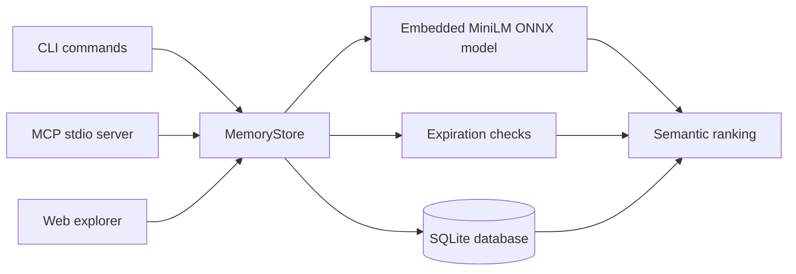

# mii-memory

mii-memory is a local-first memory store for AI agents. It gives agents a small, durable place to keep useful facts across global, workspace, and session scopes, then retrieve them later with tag filters, text matching, and semantic ranking from an embedded MiniLM model.

It can run as a Unix-like CLI, a stdio MCP server, or a small built-in web explorer for browsing the SQLite store.

## Contents

- [Quick Start](#quick-start)
- [What It Does](#what-it-does)
- [Core Concepts](#core-concepts)
- [CLI Reference](#cli-reference)
- [MCP Server](#mcp-server)
- [Explorer](#explorer)
- [Configuration](#configuration)
- [Architecture](#architecture)
- [Development](#development)
- [Contributing](#contributing)
- [Related Projects](#related-projects)

## Quick Start

Build the binary:

```sh
cargo build --release
```

Store a memory in a local SQLite database:

```sh
DB="$PWD/.mii-memory.db"

./target/release/mii-memory --db "$DB" set \
  "Use cargo test before changing the storage layer." \
  --mode workspace \
  "$PWD" \
  --tag rust \
  --tag testing
```

Search for it:

```sh
./target/release/mii-memory --db "$DB" get \
  "how should storage changes be tested?" \
  --tag rust \
  --limit 3
```

List the tags currently available:

```sh
./target/release/mii-memory --db "$DB" list-tags --json
```

Open the explorer:

```sh
./target/release/mii-memory --db "$DB" explorer
```

Then visit `http://127.0.0.1:4117`.

For everyday use, install the binary from this checkout:

```sh
cargo install --path .
```

## What It Does

mii-memory is designed for agent memory that should outlive a single context window without becoming a giant unstructured log. Each memory has content, tags, a scope, optional metadata, optional expiration rules, and embeddings that make later retrieval less brittle than exact text search alone.

Feature snapshot:

- SQLite-backed storage with schema migrations.
- Global, workspace, and session memory scopes.
- Required tags for navigation and filtering.
- Semantic ranking from an embedded 384-dimensional MiniLM model.
- Positive and negative relevance scores that evolve as memories are retrieved or superseded.
- Optional expiration based on time, usage count, file existence, file freshness, or active period.
- One-shot session alerts for reminders that clear when read.
- Sub-session lineage, using IDs such as `parent/child`, for agent forks and subagents.
- CLI, MCP, and web explorer interfaces over the same store.

## Core Concepts

### Scopes

| Scope | Use it for | Mode reference |
| --- | --- | --- |
| `global` | Preferences and facts useful everywhere. | None. |
| `workspace` | Project-specific memory. | Defaults to the current directory when omitted. |
| `session` | Conversation or agent-run memory. | Defaults to `MII_MEMORY_SESSION`, then `MCP_SESSION_ID`, then `default`. |

MCP calls infer the mode reference for the current server process, so agent tools only choose the mode.

### Tags

Tags are required on writes. They behave like lightweight directories: agents can list tags, filter by positive tags, downrank negative tags, and use tag names as retrieval clues. Tags are normalized to lowercase and deduplicated.

### Search and Relevance

On write, mii-memory embeds both the content and tags, then stores a blended vector. On read, it scores memories using semantic similarity, text matches, tag filters, and the memory's accumulated positive and negative scores.

Retrieval increases a memory's positive score. Adding a very similar memory increases the older related memory's negative score, which lets newer or competing information gradually reshape what is considered relevant without deleting history.

### Expiration

Expiration is checked when memories are read or browsed. Supported conditions are:

| Condition | Value examples | Meaning |
| --- | --- | --- |
| `time` | `30m`, `2h`, `7d`, `2026-06-01`, `2026-06-01T12:00:00Z` | Hide after a duration or instant. |
| `usage` | `3` | Hide after that many retrievals. |
| `file_exist` | `src/lib.rs` | Hide when the path no longer exists. |
| `file_pristine` | `src/lib.rs` | Hide when the file changes from its write-time fingerprint. |
| `period` | `2026-05-01..2026-06-01`, `2026-05-01,2026-06-01`, `{ "start": "2026-05-01", "end": "2026-06-01" }` | Hide outside the active period. |

Example:

```sh
mii-memory set \
  "This reminder should only be returned twice." \
  --tag reminder \
  --expiration-condition usage 2
```

### Alerts

Alerts are one-shot session reminders. They are separate from normal memories, have no tags or embeddings, and are deleted as soon as they are returned.

```sh
mii-memory alert set my-session "Review the storage migration before compacting."
mii-memory alerts my-session
```

Session references share lineage. A session such as `parent/child` can see alerts and session memories tied to `parent`, and the parent can see child entries.

## CLI Reference

All CLI commands accept `--db <PATH>` or `MII_MEMORY_DB=<PATH>`. Without either, mii-memory uses `.mii-memory.db` in the current directory.

### Store a Memory

```sh
mii-memory set <CONTENT> [MODE_REF] \
  --tag <TAG> \
  [--tag <TAG> ...] \
  [--mode global|workspace|session] \
  [--expiration-condition <CONDITION> <VALUE>] \
  [--metadata <TEXT>]
```

The command prints line-delimited JSON:

```json
{"id":1}
```

### Retrieve Memories

```sh
mii-memory get <QUERY> \
  [--tag <TAG> ...] \
  [--n-tag <TAG> ...] \
  [--limit <N>] \
  [--offset <N>] \
  [--mode global|workspace|session] \
  [--mode-ref <REF>]
```

`--tag` is a positive filter. `--n-tag` does not remove memories outright; it downranks matching results.

### List Tags

```sh
mii-memory list-tags [--filter <TEXT>] [--json]
```

Without `--json`, each tag is printed on its own line. With `--json`, each line includes the tag and current count.

### Alerts

```sh
mii-memory alert set <SESSION_REF> <CONTENT>
mii-memory alerts <SESSION_REF>
```

`alerts` returns matching alerts as JSON lines and clears the returned rows.

### Other Commands

```sh
mii-memory mcp
mii-memory explorer [--host 127.0.0.1] [--port 4117]
```

## MCP Server

Start the stdio MCP server with:

```sh
mii-memory --db /path/to/memory.db mcp
```

Example MCP client configuration:

```json
{
  "mcpServers": {
    "mii-memory": {
      "command": "mii-memory",
      "args": ["--db", "/path/to/memory.db", "mcp"]
    }
  }
}
```

The server supports JSON-RPC tool discovery through `tools/list` and `tools/call`, plus these tools:

| Tool | Purpose |
| --- | --- |
| `memory_set` | Store a memory with content, mode, tags, optional expiration, and optional metadata. |
| `memory_get` | Retrieve ranked memories by query, tags, limit, offset, and optional mode. |
| `list_tags` | List available tags, optionally filtered by text. |
| `alert_set` | Store a one-shot alert for the current MCP session. |
| `alerts_get` | Return and clear one-shot alerts for the current MCP session. |

For simple scripting, the server also accepts newline-delimited direct commands:

```sh
printf '%s\n' '{"command":"list_tags","arguments":{}}' | mii-memory mcp
```

MCP session references are generated per server process. `workspace` mode references are inferred from the current directory, and `session` mode references use that process session ID.

## Explorer

The explorer is a small HTTP UI compiled into the binary. It serves the main page, memory browsing endpoints, tag endpoints, and a server-sent-events stream for live updates.

```sh
mii-memory explorer --host 127.0.0.1 --port 4117
```

The UI can:

- Search memories semantically and by text.
- Filter by scope and tags.
- Show scores, usage counts, metadata, expiration rules, and mode references.
- Refresh automatically when the underlying store changes.

## Configuration

| Setting | Used by | Default |
| --- | --- | --- |
| `--db <PATH>` | All commands | Overrides the database path. |
| `MII_MEMORY_DB` | All commands | Used when `--db` is not provided. |
| `MII_MEMORY_SESSION` | CLI session scope | Used to infer session `mode_ref`. |
| `MCP_SESSION_ID` | CLI session scope | Fallback session ID when `MII_MEMORY_SESSION` is not set. |

If no database path is configured, mii-memory creates or opens `.mii-memory.db` in the current directory.

## Architecture



Important modules:

| Module | Responsibility |
| --- | --- |
| `src/cli.rs` | Clap command definitions, argument parsing, and CLI output. |
| `src/store.rs` | SQLite migrations, writes, reads, scoring, browsing, alerts, and scope inference. |
| `src/embedding.rs` | Embedded MiniLM model loading, tokenization, vector encoding, and similarity helpers. |
| `src/expiration.rs` | Expiration validation and runtime checks. |
| `src/mcp.rs` | Stdio JSON-RPC/direct-command MCP interface and tool schemas. |
| `src/explorer.rs` | Minimal HTTP server for the built-in explorer. |
| `src/explorer/index.html` | Explorer UI. |
| `weights/` | ONNX model and vocabulary embedded into the binary at compile time. |

The database schema is versioned with SQLite `PRAGMA user_version`. Data changes should be handled through migrations so existing memory stores stay readable.

## Development

Common commands:

```sh
cargo fmt
cargo test
cargo clippy --all-targets -- -D warnings
```

Run the CLI during development:

```sh
cargo run -- --db ./.mii-memory.dev.db set \
  "Development memory" \
  --tag dev

cargo run -- --db ./.mii-memory.dev.db get "development"
```

Run the explorer during development:

```sh
cargo run -- --db ./.mii-memory.dev.db explorer
```

## Contributing

Contributions are welcome. The most important rule is to protect existing user data: storage changes should be migration-based, non-destructive, and covered by behavior-focused tests.

A good pull request usually includes:

- A short description of the behavior being changed.
- Focused tests for storage, expiration, scoring, CLI, MCP, or explorer behavior as appropriate.
- No unrelated formatting churn or broad refactors mixed into feature work.
- Clear notes for any database schema migration.

## Related Projects

- [Model Context Protocol](https://modelcontextprotocol.io/) for connecting tools and agent clients.
- [SQLite](https://www.sqlite.org/) for the embedded database engine.
- [tract](https://github.com/sonos/tract) for running the embedded ONNX model in Rust.